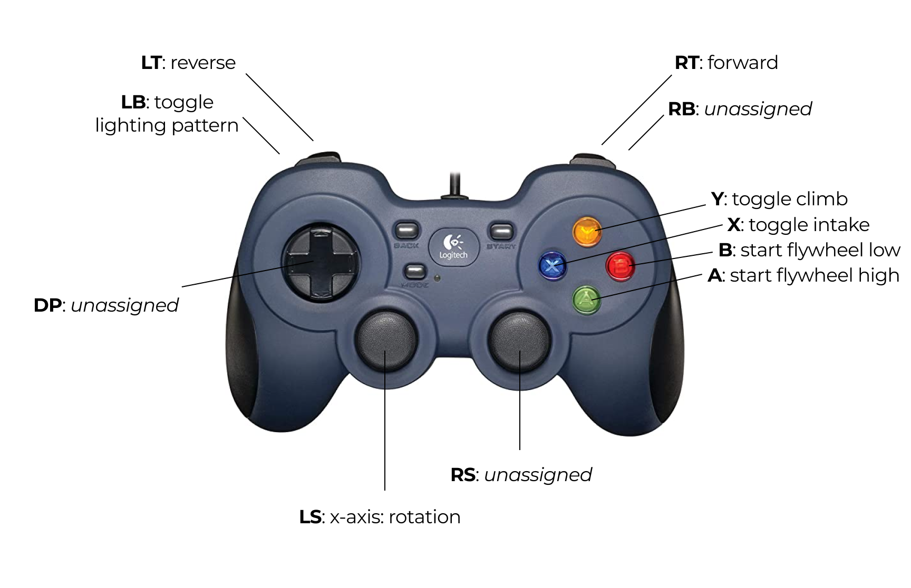

# MaxX

MaxTech 4343's and NextGen 914's robot code for *Rapid React, 2022*.

## Setup

### General

 1. Clone this repository.
 2. Run `./gradlew --help` to initialize Gradle and view its options.
 3. Run `./gradlew tasks` to see available tasks.

Some common tasks are `simulateJava` and `deploy`.

### Controls

## Code highlights

### Library

The library contains robot-agnostic support code. A more accurate description for each type can be found in each package.

#### Annotations

The library contains reader-oriented Java annotations, such as `Tested` and `IncompleteIO`, that mark specific information for the user.

#### Command

The library contains wrappers to WPILib's command-based control system, which offer additional, strongly-typed flexibility at no cost.

#### Controllers

The library contains state-space controllers for elements, such as flywheels, that enable smooth, stateful, multi-input multi-output transformations.

#### Logging

The library contains support for logging information from the robot to the local device. This information is also passed into NetworkTables.

#### Managers

The library contains managers, that have the ability to monitor and manage WPILib-specific elements, such as subsystems. These managers go hand-in-hand with the different abstractions offered by [command](#command).

#### Statemachines

The library contains support for state machines, an orientation specifically designed for type safety.

#### Wrappers

The library contains extended support and shims for some hardware, where appropriate. These each still depend on the vendored dependencies: they only *extend* hardware support, not *rewrite*.

### Robot code

Beyond our library, there is also robot-specific code.

#### [`com.maxtech.maxx`](src/main/java/com/maxtech/maxx)

The top-level base for robot programs. Contains pre-defined constants as well as other boilerplate code.

#### [`packages.maxtech.maxx.subsystems`](https://github.com/frc4343-914/MaxX/blob/master/src/main/java/com/maxtech/maxx/subsystems)

The package for command-based subsystems. Note that these commonly also contain state machines and are instanced types.

#### [`packages.maxtech.maxx.subsystems.*`](https://github.com/frc4343-914/MaxX/blob/master/src/main/java/com/maxtech/maxx/subsystems/flywheel)

Most subsystems have differing I/O between team robots. These each own a folder to their name, with a few common elements. The following is an example for the `flywheel` subsystem package:

 * `Flywheel` is the high-level subsystem, which contains public methods and internal state. It also keeps a reference to some type that implements `FlywheelIO`, that is decided during runtime.
 * `FlywheelIO` is the interface for I/O. It does not implement any code itself, but rather creates a "template" for other classes to implement. Some example methods that I/O interfaces include are `getVelocity`, `setVoltage`, etc.
 * `FlywheelIOMax` is the FlywheelIO implementation for Max X. It implements all methods required by FlywheelIO, and holds references to any related I/O objects (commonly, motor controllers). The latter point is, in fact, the whole reason for this structure.
 * `FlywheelIOPeter` is the FlywheelIO implementation for Peter, similar to above.

#### [`packages.maxtech.maxx.commands`](https://github.com/frc4343-914/MaxX/blob/master/src/main/java/com/maxtech/maxx/commands)

The package for command-based commands.

##### [`packages.maxtech.maxx.commands.autonomous`](https://github.com/frc4343-914/MaxX/blob/master/src/main/java/com/maxtech/maxx/commands/autonomous)

The package for autonomous commands. Contains pathweaver wrappers as well as Limelight-specific autonomous code.

### Vision

The [`/vision`](vision) folder also contains Limelight vision code, written for tracking colored balls. Please read more in the folder-specific [README](vision/README.md).